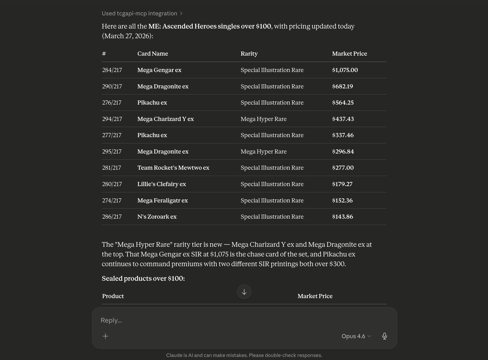

# tcgapi-mcp

A [Model Context Protocol (MCP)](https://modelcontextprotocol.io) server for trading card game data from the TCG Tracking API.

`tcgapi-mcp` runs as a local stdio MCP server and is designed for MCP hosts such as Claude Desktop. It currently provides category discovery, set search, product lookup, pricing lookups, SKU comparisons, and freshness metadata for recency-sensitive answers.

This project is currently a read-only MCP server with:

- 7 tools
- 4 concrete resources
- 6 resource templates
- 6 prompts
- cross-platform release archives for macOS, Linux, and Windows

## Table of Contents

- [Features](#features)
- [Quick Start](#quick-start)
- [Configuration](#configuration)
- [MCP Client Compatibility](#mcp-client-compatibility)
- [Available Capabilities](#available-capabilities)
- [Example Output](#example-output)
- [Freshness and Data Guidance](#freshness-and-data-guidance)
- [Development](#development)
- [Troubleshooting](#troubleshooting)
- [Contributing](#contributing)
- [Security](#security)
- [License](#license)

## Features

- Read-only TCG data access through MCP
- Category discovery and flexible category resolution by ID, name, or alias
- Set search and product lookup
- Set pricing and SKU-level comparison data
- Expansion release-count analytics
- Deterministic set-insights summaries for rarity, numbering, and top market cards
- Top-level `updated_at` freshness metadata on pricing and SKU responses
- `tcg:///meta` resource for overall upstream freshness and counts
- Official Go MCP SDK implementation
- Cross-platform release builds via GoReleaser

## Quick Start

### 1. Install

Download the archive for your platform from GitHub Releases.

Release artifacts are published as:

- `tcgapi-mcp_<version>_darwin_amd64.tar.gz`
- `tcgapi-mcp_<version>_darwin_arm64.tar.gz`
- `tcgapi-mcp_<version>_linux_amd64.tar.gz`
- `tcgapi-mcp_<version>_linux_arm64.tar.gz`
- `tcgapi-mcp_<version>_windows_amd64.zip`
- `tcgapi-mcp_<version>_windows_arm64.zip`

Example for macOS or Linux:

```bash
tar -xzf tcgapi-mcp_<version>_<os>_<arch>.tar.gz
chmod +x tcgapi-mcp
mv tcgapi-mcp ~/.local/bin/tcgapi-mcp
```

Verify the binary:

```bash
tcgapi-mcp --version
```

### 2. Configure Claude Desktop

Add the server to your `claude_desktop_config.json`:

```json
{
  "mcpServers": {
    "tcgapi-mcp": {
      "command": "tcgapi-mcp",
      "args": [],
      "env": {}
    }
  }
}
```

If Claude Desktop does not resolve your `PATH`, use an absolute path for `command`.

Optional cache persistence:

```json
{
  "mcpServers": {
    "tcgapi-mcp": {
      "command": "/absolute/path/to/tcgapi-mcp",
      "args": [],
      "env": {
        "TCG_CACHE_DIR": "/absolute/path/to/cache-dir"
      }
    }
  }
}
```

### 3. Use

Restart Claude Desktop and try prompts like:

- "List the available TCG categories."
- "Search Pokemon sets for Surging Sparks."
- "Get products for set ID 41036 in Pokemon."
- "Get pricing for that set."
- "Compare SKU variants for this card."
- "How many Pokemon sets were released after 2000?"
- "Give me a set-insights summary for this expansion."

## Example Output

Example prompt:

> Show me all the ME: Ascended Heroes singles over $100 and make sure the pricing was updated today.

For singles-style analytics queries, hosts should call `analyze_set_insights` with `product_kind_filter=single_like`, set `min_market_price` for price-threshold requests, raise `top_n` when the user wants a longer singles list, and use `fields=["top_market_cards"]` or `fields=["top_market_cards","market_sum_estimate"]` for token-efficient ranking responses. Omit `fields` when the user wants the default set overview payload, read `tcg:///meta/heuristics` for the shared methodology notes, or request `fields=["heuristic_notes"]` when those notes need to be inline.

Example Claude Desktop-style result captured on March 27, 2026:



Example summary:

> The "Mega Hyper Rare" rarity tier is new. Mega Charizard Y ex and Mega Dragonite ex appear near the top of the list, while Mega Gengar ex is the set's chase card at over $1,000.

Live results will vary over time. For recency-sensitive answers, hosts should cite the returned `updated_at` field rather than assume current pricing freshness.

## Configuration

| Variable | Default | Purpose |
| --- | --- | --- |
| `TCG_API_URL` | `https://tcgtracking.com/tcgapi/v1` | Upstream API base URL |
| `TCG_API_TIMEOUT` | `30s` | HTTP timeout for upstream requests |
| `TCG_CACHE_DIR` | unset | Enables cache persistence across restarts |
| `TCG_CACHE_MAX_MB` | `256` | In-memory cache size limit |
| `TCG_LOG_LEVEL` | `info` | Log verbosity: `debug`, `info`, `warn`, `error` |
| `TCG_PAGE_SIZE` | `50` | Default page size for paginated product results |

Runtime constraints:

- stdout is reserved for MCP protocol traffic
- logs go to stderr
- `TCG_CACHE_DIR` is optional but useful for repeated local use

## MCP Client Compatibility

This server is currently designed for MCP clients that support launching a local stdio server.

Tested:

- Claude Desktop

Expected to work:

- other MCP hosts that support stdio transport and local process execution

Generic stdio server settings:

- command: `tcgapi-mcp`
- args: `[]`
- env: optional `TCG_CACHE_DIR`, `TCG_LOG_LEVEL`, `TCG_API_TIMEOUT`, `TCG_PAGE_SIZE`

Current transport support:

- stdio: supported
- HTTP: not implemented
- SSE: not implemented

## Available Capabilities

### Tools

- `list_categories`
- `search_sets`
- `get_set_products`
- `get_set_pricing`
- `get_set_skus`
- `summarize_release_counts`
- `analyze_set_insights`

### Resources

- `tcg:///meta`
- `tcg:///meta/heuristics`
- `tcg:///categories`
- `tcg:///analytics/releases-by-year`

### Resource Templates

- `tcg:///{categoryId}/sets`
- `tcg:///{categoryId}/sets/{setId}`
- `tcg:///{categoryId}/sets/{setId}/pricing`
- `tcg:///{categoryId}/sets/{setId}/skus`
- `tcg:///{categoryId}/analytics/releases-by-year`
- `tcg:///{categoryId}/sets/{setId}/insights`

### Prompts

- `price-check`
- `set-overview`
- `compare-variants`
- `expansion-history`
- `set-insights`
- `value-drivers`

### Notes

- category inputs accept numeric IDs, category names, and aliases such as `Pokemon` or `mtg`
- pricing and SKU responses include top-level `updated_at`
- `tcg:///meta` exposes overall upstream freshness and dataset counts
- `tcg:///meta/heuristics` exposes shared methodology notes for heuristic analytics fields
- release-count and set-insights outputs are deterministic summaries computed from current API data
- `analyze_set_insights` accepts optional `fields` to return only selected analysis sections while keeping the canonical `tcg:///{categoryId}/sets/{setId}/insights` resource unchanged; omitting `fields` returns the default overview payload without inline `heuristic_notes`

## Freshness and Data Guidance

For recency-sensitive questions:

- use `updated_at` from pricing responses when answering about set or product pricing freshness
- use `updated_at` from SKU responses when answering about SKU snapshot freshness
- use `tcg:///meta` when the question is about overall API freshness rather than one pricing or SKU response

The server is read-only. It does not create, update, or delete data.

Not currently supported:

- booster-pack slot mapping
- booster-pack card counts
- secret-rare slot detection
- pull-rate probability calculations
- artist- or illustration-based value analysis

## Development

Build from source:

```bash
make build
```

Run tests:

```bash
make test
```

Validate the OpenAPI contract and generated code:

```bash
make openapi-validate
make generate-check
```

Run the server locally over stdio:

```bash
make run
```

The checked-in OpenAPI source of truth is [`openapi/tcgtracking-openapi.yaml`](openapi/tcgtracking-openapi.yaml).

## Troubleshooting

### macOS Gatekeeper blocks the binary

Downloaded macOS binaries are not signed or notarized yet.

If macOS blocks the binary, either allow it in `System Settings` -> `Privacy & Security`, or remove the quarantine attribute manually:

```bash
xattr -d com.apple.quarantine /absolute/path/to/tcgapi-mcp
```

### Claude Desktop does not see the server

Check:

- the JSON config is valid
- the binary path is correct
- the binary is executable
- Claude Desktop was fully restarted after the config change

If needed, use an absolute path for `command` instead of relying on `PATH`.

### Pricing freshness answers seem uncertain

Hosts should cite `updated_at` from pricing or SKU responses instead of inferring freshness from the current date alone. For overall API freshness, use `tcg:///meta`.

## Contributing

Contributions are welcome. See [CONTRIBUTING.md](CONTRIBUTING.md) for development expectations and common commands.

If you are changing MCP behavior, keep these constraints in mind:

- keep generated OpenAPI code confined to `internal/tcgapi/generated`
- keep higher layers depending on handwritten domain models and wrapper types
- keep runtime diagnostics on stderr, never stdout

## Security

Please do not report vulnerabilities in public issues. See [SECURITY.md](SECURITY.md).

## License

This project is released under the [LICENSE](LICENSE) in this repository.
